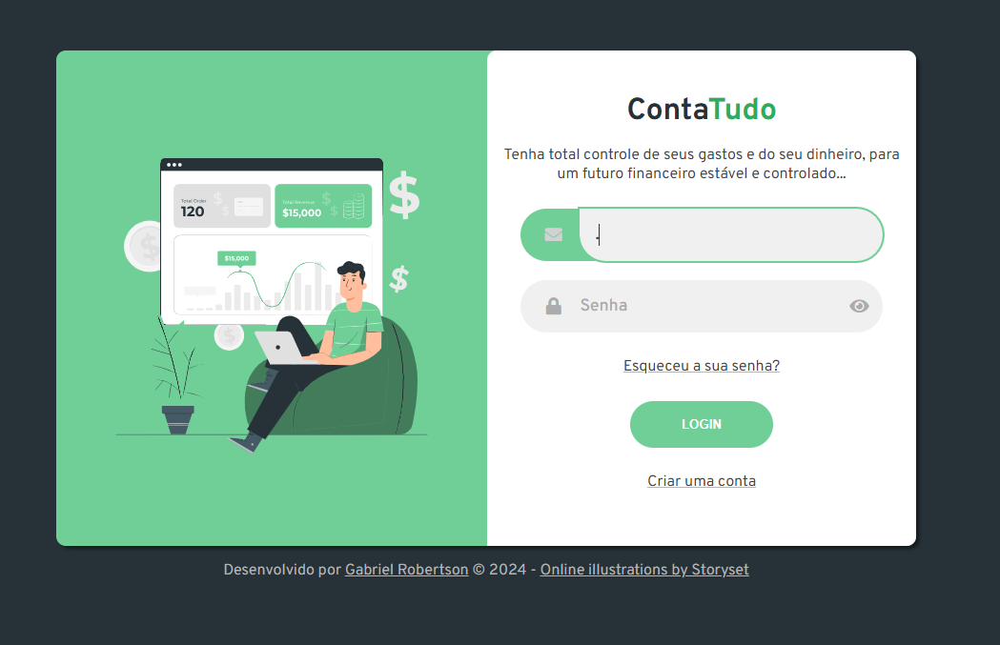
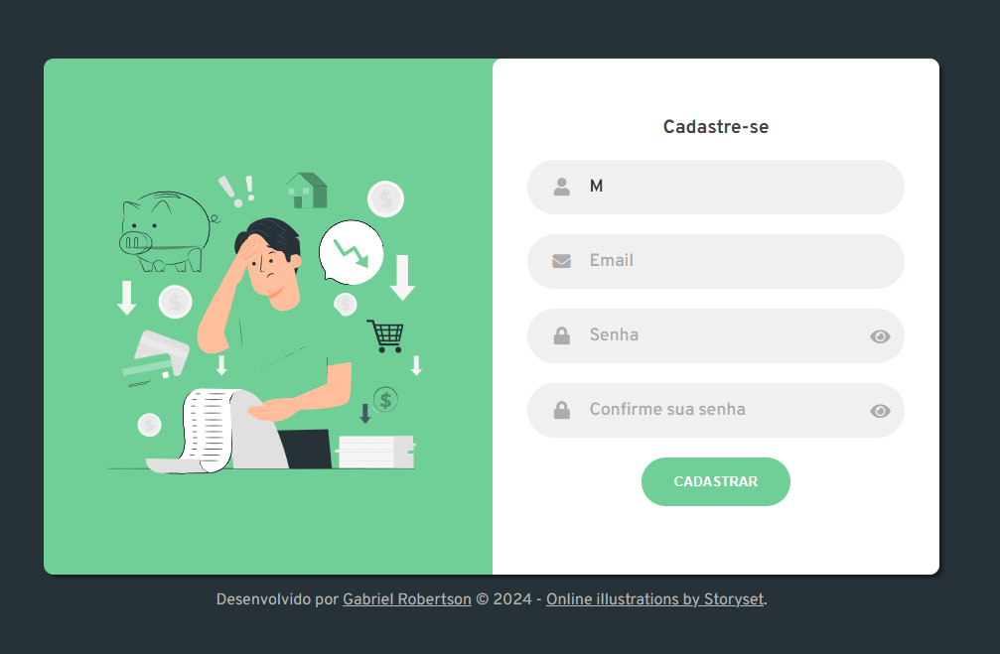
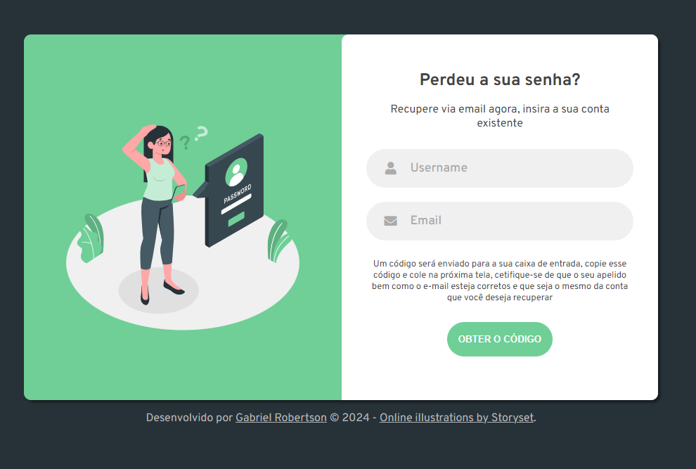

<h4 align="center"> 
	
</h4>

Sobre o projeto....

### 🛠️ Tecnologias
 
 
 

### Detalhes do projeto

> - **Fazer login.**
> - **Cadastrar um novo usuário.**
> - **Recuperar  Senha.**

Feito por  [Gabriel Robertson](https://github.com/Gabrielrsc) 🤖